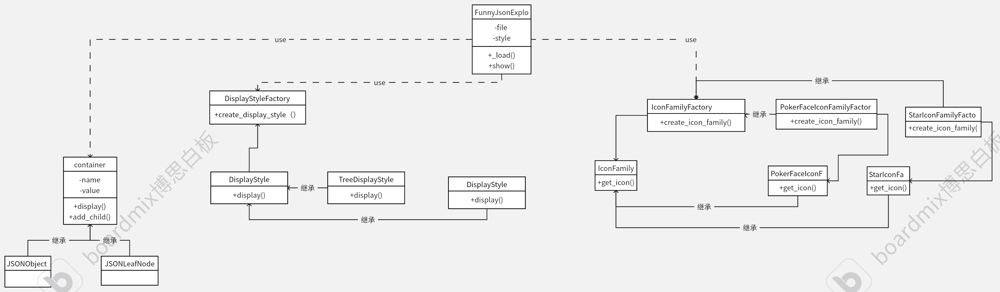
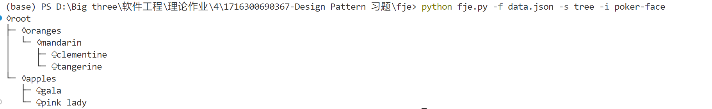
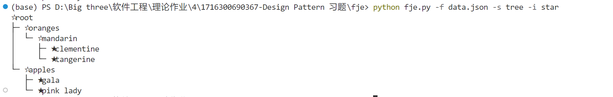
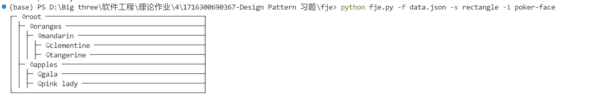
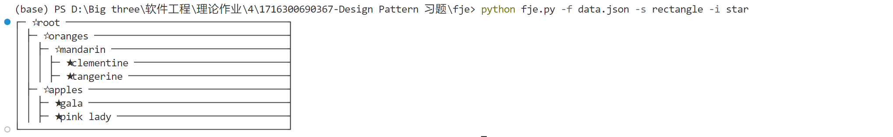

### 项目所在地址

https://github.com/jkkk23/fje

### 设计模式的应用

工厂方法（Factory Method）：用于创建不同风格的展示对象（TreeDisplayStyle、RectangleDisplayStyle）。

抽象工厂（Abstract Factory）：用于创建不同图标族的展示对象（PokerFaceIconFamily、OtherIconFamily）。

建造者（Builder）：用于构建JSON数据结构的可视化表示。

组合模式（Composite Pattern）：用于表示JSON数据的树形结构，使得处理JSON数据的层次结构变得简单。

### 文件结构

```plaintext
fje/
├── fje/
│   ├── data.json
│   ├── fje.py
│   ├── display_style.py
│   ├── factories.py
│   ├── icon_family.py
│   └── json_node.py
├── fje_test.bat
├── README.md
└── LICENSE
```

### 类图




说明
1.Container：表示JSON数据的节点，可以是对象节点或叶子节点。

2.JSONObjectNode 和 JSONLeafNode：分别表示JSON对象节点和叶子节点。

3.DisplayStyle：抽象类，用于定义显示风格的接口。

4.TreeDisplayStyle 和 RectangleDisplayStyle：具体实现类，分别实现树形和矩形风格的显示。

5.IconFamily：抽象类，用于定义图标族的接口。

6.PokerFaceIconFamily 和 OtherIconFamily：具体实现类，分别实现不同的图标族。

7.DisplayStyleFactory：工厂类，用于创建不同的显示风格对象。

8.IconFamilyFactory：工厂类，用于创建不同的图标族对象。

### 实验结果
调用测试文件fje_test.bat，使用文件data.json进行测试，得到测试结果如下：









### 添加风格

只需要在icon_family.py中添加新的图标组，并在factories.py中调用即可
