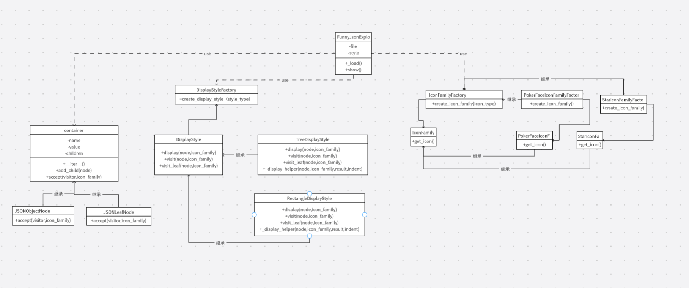

### 项目所在地址

https://github.com/jkkk23/fje/tree/new1

### 设计模式的应用

**迭代器+访问者模式的结合**
在这个项目中，迭代器模式和访问者模式结合使用，使得可以方便地遍历 JSON 数据结构，并对不同类型的节点进行不同的展示操作。

1.**迭代器模式**：过实现 `__iter__` 方法，`container` 类及其子类可以被迭代，从而可以使用 `for` 循环来遍历其子节点。

2.**访问者模式**：通过定义 `visit` 和 `visit_leaf` 方法，`DisplayStyle` 类可以对 `container` 类及其子类进行不同的操作。`container` 类及其子类通过 `accept` 方法接受访问者，并调用访问者的相应方法。

这种结合使得代码结构更加清晰，职责分离更加明确，符合面向对象设计的原则。

 - **单一职责原则**：每个类只有一个引起变化的原因。例如，DisplayStyle 及其子类负责展示逻辑，而 container 及其子类负责数据结构。
 - **开闭原则**：可以通过添加新的访问者来扩展系统，而不需要修改现有的类。例如，可以添加新的展示风格，而不需要修改 container 及其子类。
 - **依赖倒置原则**：高层模块不应该依赖于低层模块，二者都应该依赖于抽象。例如，FunnyJsonExplorer 依赖于 DisplayStyle 和 IconFamily 的抽象，而不是具体实现。


通过这种设计，可以方便地扩展和维护系统，同时提高代码的可读性和可复用性。
### 文件结构

```plaintext
fje/
├── fje/
│   ├── data.json
│   ├── fje.py
│   ├── display_style.py
│   ├── factories.py
│   ├── icon_family.py
│   └── json_node.py
├── fje_test.bat
├── README.md
└── LICENSE
```

### 类图




类详细介绍
1. DisplayStyle :抽象类，定义了展示风格的接口，包含 display、visit 和 visit_leaf 方法。

2. TreeDisplayStyle :具体类,实现树形展示风格。

3. RectangleDisplayStyle :具体类,实现矩形展示风格。

4. DisplayStyleFactory :具体类,用于创建不同风格的展示对象。

5. IconFamilyFactory :具体类,用于创建不同图标族的展示对象。

6. IconFamily:抽象类,定义了图标族的接口。

7. PokerFaceIconFamily:具体类,实现扑克图标族。

8. StarIconFamily :具体类,实现星星图标族。

9. container :具体类,表示一个容器节点，可以包含子节点。

10. JSONObjectNode :具体类,表示一个 JSON 对象节点。

11. JSONLeafNode :具体类,表示一个 JSON 叶子节点。

12. FunnyJsonExplorer :具体类,主程序类，用于加载 JSON 文件并展示。

13. build_json_tree :函数,构建 JSON 数据的树形结构。

### 实验结果
调用测试文件fje_test.bat，使用文件data.json进行测试，得到测试结果如下：


### 添加风格

如果要添加新的展示风格，步骤只需两步：

1.创建新的 `DisplayStyle` 子类，实现 `visit` 和 `visit_leaf` 方法。

2.在 `DisplayStyleFactory` 中添加新的创建逻辑。
